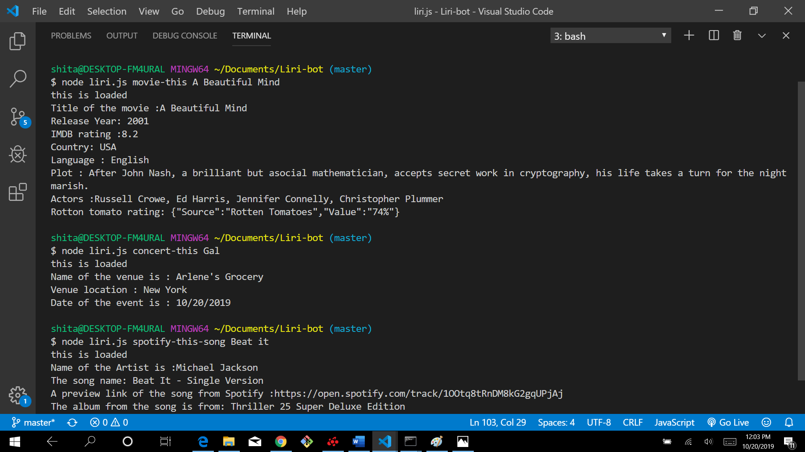

## Liri Bot

#### Overview:
LIRI is like iPhone's SIRI. However, while SIRI is a Speech Interpretation and Recognition Interface, LIRI is a Language Interpretation and Recognition Interface. LIRI will be a command line node app that takes in parameters and gives you back data.

#### Technologies used:

* node.js
* npm packages
* OMDB API
* Bands in town API
* Spotify API

#### Code:
function spotifyThisSong() {

    //If user doesn't choose any song then it will display The sign.
    if(!userInput){
        userInput = "The Sign";
    }

 var spotify = new Spotify({

    id: process.env.SPOTIFY_ID,

  secret: process.env.SPOTIFY_SECRET

});

spotify.search({ type: 'track', query: userInput },

 function(err, data) {
     
    if (err) {
      return console.log('Error occurred: ' + err);
    }

#### Bonus:
 ##### This function create log.txt file and add all search data in it.

    fs.appendFile("log.txt", userInput , function(err){

#### Installation:

* axios
* moment
* node-spotify-api
* dotenv

